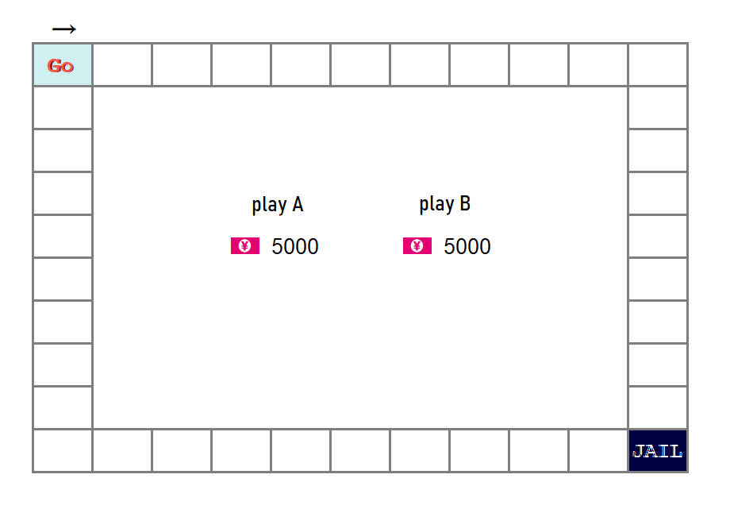

# 大富翁游戏实现

【来源】大二 C++ 期中项目练习

编程一个叫做 大富翁(monopoly) 的游戏。这个游戏由两个玩家（在这个作业中是你和电脑）玩。这个游戏是在游戏板上玩的，界面如图。

起始存款是5000。游戏规则及更多设计细节见 

## 技术选项

Go语言开发

界面使用 SDL。💭 想学习C语言和 CGo，正好利用。

> 学一个东西要意识到它在什么时候能用上，用不上就不要学。知识没有在印象中解决任何问题，合上书就忘了。

## 项目使用

采用 `git-worktree` 维护多个版本的大富翁（不是分支哦），目前先开发 go版本的。

## Reference

暂无，全新版本
