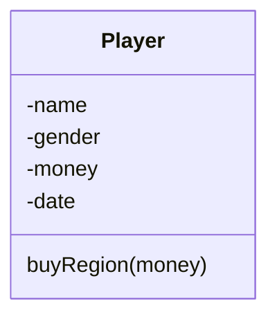
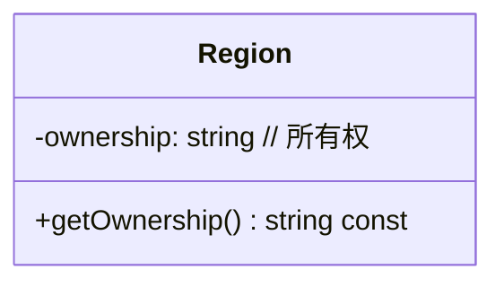

## 一、需求和功能说明

【需求】大作业常见题，供学生（大二阶段）练习 C++ 类的使用，这里拿来练习 go

1. 设计和实现至少3个类或者结构体。
2. 用一个文件来记录玩家的信息，不使用数据库。

【功能说明】

你被要求用 go 编程一个叫做大富翁的游戏。单机版，只有你和电脑两个玩家。游戏及其规则描述如下。

`PS` 要玩这个游戏，每个玩家必须先建立一个正余额的账户，假设起始存款是5000。随着游戏的进行，程序能够跟踪余额的变化。

这个游戏是在游戏板上玩的，界面如下图。


> 这个棋盘由38个方格组成。除了左上角的方格，其余每个方格都有一个价格标签，来代表所有权（这个价格可能在一个价格范围内随机生成，比如 10~300）。
>
> 左上角的方格是开始的方格（“Go” 方格，每场游戏都从这里开始）。每一个玩家通过这个“Go”方块的时候，他的账户余额就会增加200。

你和电脑轮流掷骰子，每次掷的结果是 1~6 的范围内的随机正整数，这决定了玩家在棋盘上顺时针方向可以前进多少方格。在你落在一个方块上之后：

（1）除了Go和JAIL之外，如果这个方块是空的，你可以决定是否买它；

（2）如果这个方块被买了，表示被你占据了，那么你可以什么也不做。

（3）如果这个方块被其他玩家占领，而相邻的方块未被占领或者被你占领，你讲被扣款 10% 的方块价格。

（4）如果这个方块及其相邻的一个方块都被你的对手占领，即有其他玩家购买了连续的2个方块，你将被方块方块价格的 20%。即使其他玩家购买的连续方格超过2个，扣款最高只达到路过方格的20%。

（5）如果方块的拥有者决定在刚刚买下的方格上投资，每个方格的罚款可以进一步增加 5%。投资的规模是广场价格的一半（这意味着业主需要支付1.5倍的架构来购买和投资该方格）。

（6）如果玩家落在右下角的 JAIL 方格，则需要等待一轮后才能继续移动。

当其中一名玩家的余额小于0时，宣布破产，游戏结束。或者你选择推出游戏时，游戏结束。结束时显示各自的余额情况。

## 二、技术架构

### 2.1 交互图

TODO

### 2.2 IPO

处理方块交易模块

|      输入      |          处理          |      输出      |
| :------------: | :--------------------: | :------------: |
|     方块号     |     判断是否被占据     |     是/否      |
| 未被占据的方块 |        是否购买        | 余额运算和标记 |
|   占据的方块   | 判断相连方块是否被占据 | 余额运算和标记 |
|  到达原点方块  |        余额+200        |       无       |


## 三、类图

### 3.1 玩家类




### 3.2 方格类

每个方格表示一个地区。



TODO


## 四、接口设计

### 4.1 输入接口

```
wang
m
2022-11-15
5000
```


建立一个数据库来记录玩家的信息，项目中不使用 MySQL 之类数据库，直接使用一个 .txt 文件来记录。**玩家信息**包括姓名、性别、建号日期、账户余额等。

### 4.2 配置文件

```json
36
```

格子的数量可调整。默认总数38（配置36）


## 附录 技术规格偏移表

| 技术指标                                  | 响应 |   偏移情况    |
| ----------------------------------------- | :--: | :-----------: |
| 1 玩家信息读取                            |  OK  |    无偏移     |
| 2 玩家使用类/结构体                       |  OK  |    无偏移     |
| 3 方格使用类/结构体                       |  OK  |    无偏移     |
| 4 方格板设计符合要求                      |  OK  |    无偏移     |
| 5 方格的价格能够随机生成                  |  OK  |    无偏移     |
| 6 方格板数量可调                          |  OK  | 至少有8个格子 |
| 7 骰子可产生随机点数                      |  OK  |    无偏移     |
| 8 玩家能够按照点数前进                    |  OK  |    无偏移     |
| 9 玩家能够在方格内选择是否购买            |  OK  |    无偏移     |
| 10 玩家能够在购买时选择是否投资           |  OK  |    无偏移     |
| 11 玩家的拥有格记录可保存                 |  No  |   暂不支持    |
| 12 玩家踩中对方的格子能扣款               |  OK  |    无偏移     |
| 13 对方踩中玩家格子能增加余额             |  OK  |    无偏移     |
| 14 玩家在起点能自动增加余额               |  OK  |    无偏移     |
| 15 玩家在 JAIL时停止一次掷骰子            |  OK  |    无偏移     |
| 16 程序能够判别路过格子属于哪个玩家       |  OK  |    无偏移     |
| 17 程序能够判别相邻格子是否属于同一个玩家 |  OK  |    无偏移     |
| 18 程序运行在 Windows平台                 |  OK  |    无偏移     |
| 19 程序能够结束                           |  OK  |    无偏移     |
| 20 程序结束时支持结果显示                 |  OK  |    无偏移     |
| 21 程序提供多种版本                       |  No  |    go版本     |


